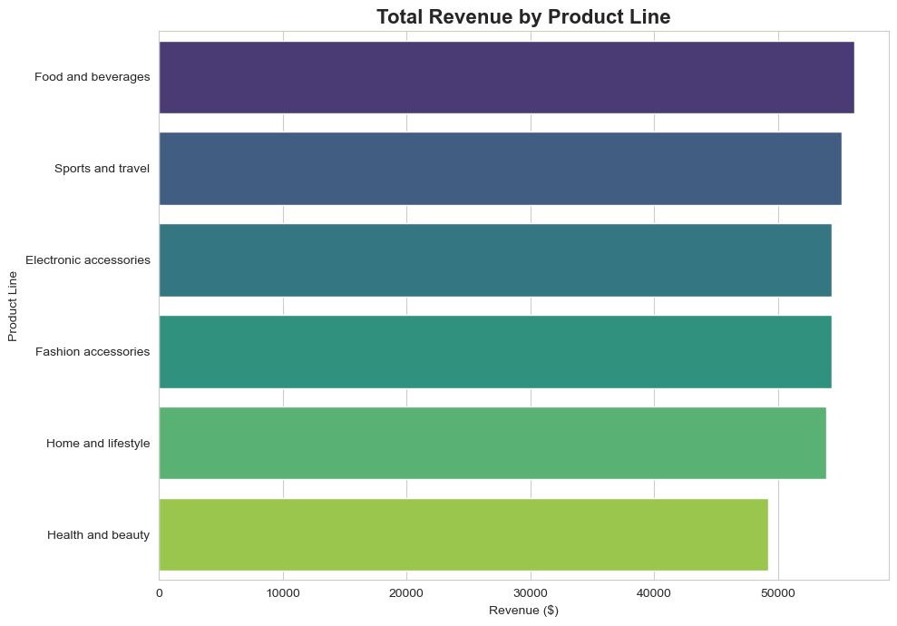
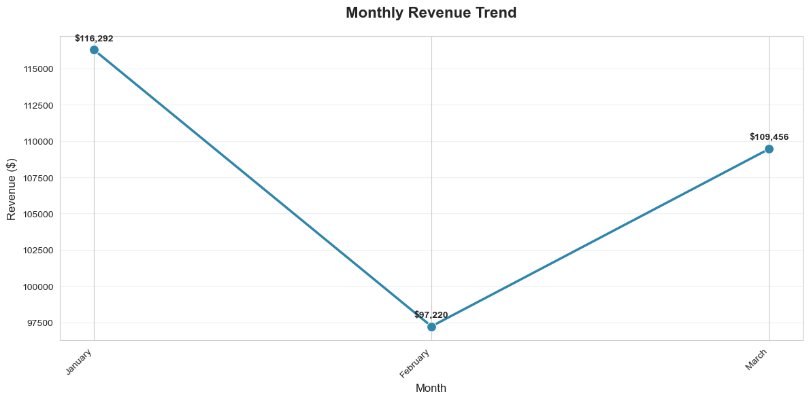
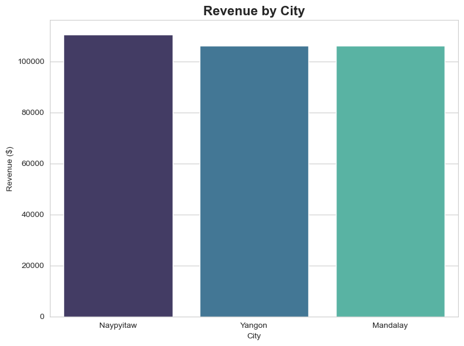
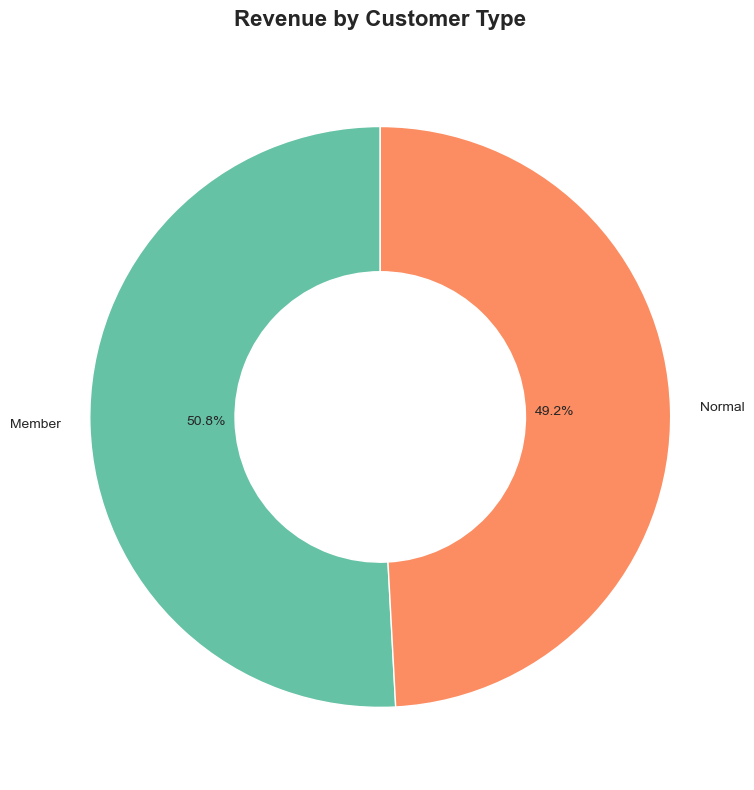

# 🛒 Walmart Sales Analysis

> SQL-based analysis of Walmart branch sales data to uncover revenue drivers, customer behavior, and operational insights.

## 🎯 Project Objective
Analyze sales transactions across multiple branches to answer key business questions about product performance, customer preferences, and revenue optimization.

## 🛠 Tools Used
- **Database**: PostgreSQL 15
- **IDE**: VS Code + pgAdmin + SQL Shell (psql)
- **Visualization**: Python (Pandas, Matplotlib, Seaborn)
- **Version Control**: Git/GitHub

## 📊 Key Insights

### 💰 Top Revenue-Generating Product Lines

- **Food & Beverages** led with $56,144.96 in revenue
- Top 3 product lines account for ~30% of total revenue

### 📈 Monthly Revenue Trend

- Peak sales occurred in [Month]
- [Add brief insight about pattern]

### 🌆 Branch Performance by City

- [City] generated the highest revenue

### 👥 Customer Segmentation

- [Customer type] contributed [X]% of total revenue

## 🔍 Business Questions Answered
✅ How many unique cities/branches in the dataset?  
✅ Which product lines drive the most revenue?  
✅ What are peak sales times by day of week?  
✅ How do customer types differ in spending behavior?  
✅ Which branches outperform in VAT contribution?  
*[Full list in `/docs/business_questions.md`]*

## 🗄 Database Schema
```sql
-- Key engineered features added:
-- • time_of_day: Morning/Afternoon/Evening segmentation
-- • day_of_week: Extracted from date for trend analysis  
-- • month: For seasonal revenue analysis
